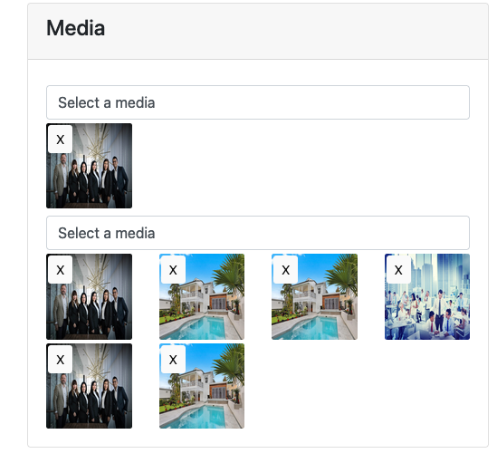
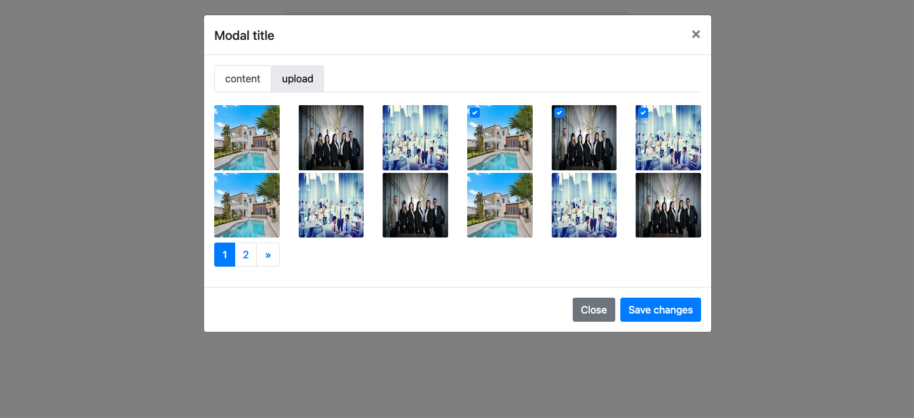

# media-component

1-To facilitate the process of using images in more than one place

2-In addition to the presence of a gallery to choose images and support Java Query

3-The images are compressed in a square shape

### requirements:

- php : 8.1

- bootstrap :  4

- JQuery

### install

step 1 :

    compser install

step 2 :

    php artisan storage:link

step 3 :

    php artisan migrate

### Examples

        /*
          name is require
          value is optional (for old value)
          id is optional (default is random string)
          when submit is : request('single') => 46 id image in database
        */       
        <x-media-component values="46" name="single" id="post"/>

        --------------------------------

        /*
        multi for multiple images
        when submit is : request('multi') => [43,42,2,44] id image in database
        */
        <x-media-component  values="[43,42,2,44]" name="multi" multi/>

### reference

- bootstrap 4

  https://getbootstrap.com/docs/4.0
- JQuery

  https://jquery.com/
- Laravel

  https://laravel.com/
- DropZone

  https://www.dropzone.dev/
- compress image

  https://image.intervention.io/v2
- Style checkbox image :

  https://iqbalfn.github.io/bootstrap-image-checkbox/

